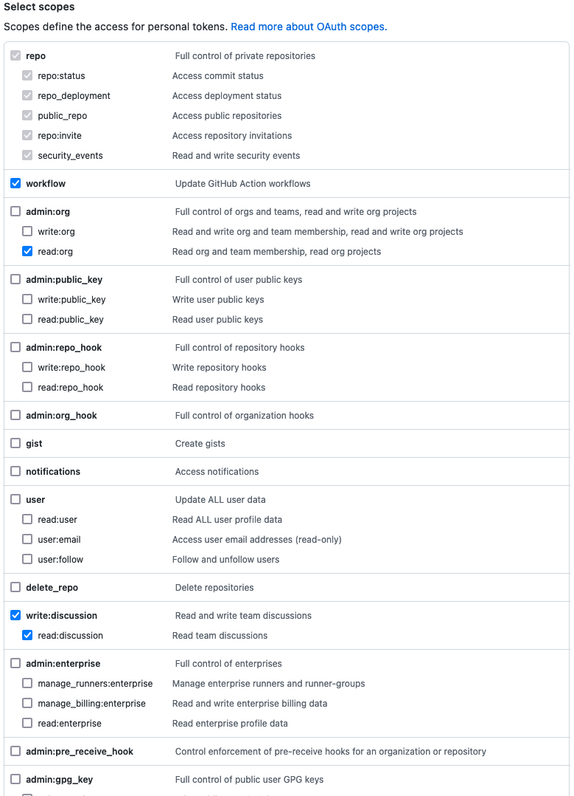

# github-metrics-api

Rest API for GitHub Metrics exporting. This application is built using Groovy 3.0, Java 17 & SpringBoot v3. It's based
on the Spring-Boot WebFlux (Reactive) Netty implementation.

To use this Application you need to configure a Github Personal GIT_TOKEN and MS_ID system environment variables:

- credentials_MS_ID
- credentials_GIT_TOKEN

1. Login to [https://github.optum.com/settings/tokens](https://github.optum.com/settings/tokens)
2. Create or use an existing PAT
3. Ensure you have at least the following scopes: `repo`, `workflow`, `read:org`, `write:discussion`
   
